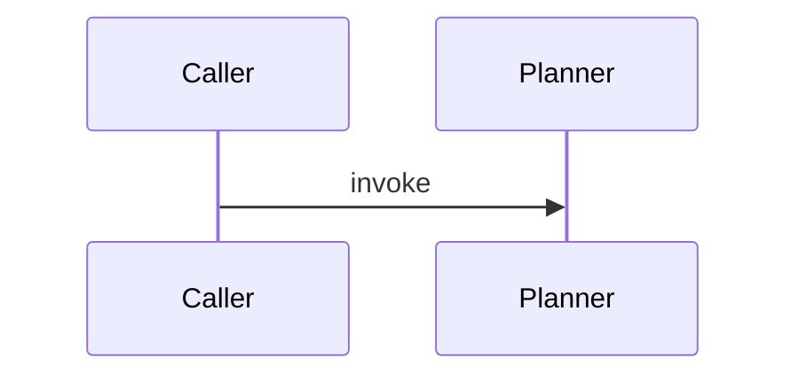

# Observability Animated HTML Strategy

Review date: 2026-06-07

## Purpose

This strategy defines how Generation Fabric should transform worker-bee observability output into animated HTML.

The current worker-bee observation path can generate schema-backed JSON, Markdown reports, and Mermaid sequence diagrams. The next projection should turn the full generated Markdown report into a standalone HTML file, render every Mermaid diagram, and animate execution steps so a reviewer can watch the observed flow unfold.

The goal is not to replace Markdown. Markdown and its JSON sidecar remain the source of truth. HTML is the interactive projection.

## Reference Research

The local reference project at `C:\source\repos\bpm\internal\markdown-viewer\MarkdownViewerWeb` already proves a similar pattern:

- Markdown is treated as the canonical source.
- Markdig parses Markdown into a canonical model.
- Markdown is rendered into an HTML fragment.
- The fragment is wrapped in a full HTML document template.
- Mermaid blocks are rendered inside the browser.
- Sequence diagrams are enhanced with custom SVG styling, click handling, and playback.
- Movements and beats are extracted from Mermaid notes and used as navigation units.
- JavaScript animates arrows, pulsing dots, participant glow, and playback timing.

For Generation Fabric, the equivalent model is:

| Loga concept | Generation Fabric concept |
| --- | --- |
| Markdown source | generated worker-bee observation Markdown |
| Movement | execution path, function, method, or object-model diagram |
| Beat | execution step |
| Sequence interaction | call, data baton, mutation, return, branch, or exception |
| Closure beat | return, terminal state, failed check, or verification result |
| Movement/beat navigation | execution/step navigation |
| Sequence enhancer | observability playback enhancer |

The implementation should borrow the pattern, not the domain language.

## North Star

```text
observability JSON
-> Markdown report
-> Markdown-to-HTML projection
-> Mermaid render
-> execution-step index
-> animated playback controls
-> standalone HTML artifact
```

The generated HTML should let a reviewer:

- read the full report as normal HTML
- see every Mermaid diagram rendered
- play the execution flow step-by-step
- inspect the active step text, participants, source anchor, mutation, or return
- jump between executions
- pause, resume, reset, and change speed

## Current Generation Fabric Surface

Generation Fabric already has useful pieces:

- `render_markdown_document(...)` renders schema-backed JSON into Markdown.
- `worker-bee-observe` writes observation schema, JSON, and Markdown sidecars.
- Observation JSON already carries `executions`, `flow_steps`, `participants`, `mutations`, `returns`, `anchor`, and Mermaid text.
- `x-markdown` supports fenced Mermaid code blocks.
- `core.artifacts` now has shared sidecar helpers for schema/data/primary artifact writes.
- `html.renderer` exists, but it is currently schema-to-semantic-HTML for layout zone contracts, not a general Markdown-to-HTML renderer.

The missing capability is a document-level Markdown-to-HTML projection with embedded interactive observability playback.

## Target Artifact Family

For an observation output named:

```text
planner-observation.md
```

the enhanced projection should write:

```text
planner-observation.schema.json
planner-observation.json
planner-observation.md
planner-observation.html
```

For future object-model observation:

```text
provider.object-model.schema.json
provider.object-model.json
provider.object-model.md
provider.object-model.html
```

The HTML should be deterministic from the Markdown and JSON sidecar.

## Implementation Surface

### New Module: `generation_fabric/html/markdown_page.py`

Own conversion from Markdown text into a full HTML document.

Recommended responsibilities:

- convert Markdown to an HTML fragment
- preserve fenced code blocks
- preserve Mermaid code fences as renderable `.mermaid` blocks
- inject document metadata
- wrap the fragment in a standalone HTML template
- embed CSS and JavaScript assets

Recommended API:

```python
def render_markdown_html_document(
    markdown: str,
    *,
    title: str = "",
    observability_data: dict[str, Any] | None = None,
    theme: str = "light",
) -> str:
    ...
```

Dependency choice:

- Prefer `markdown-it-py` or `markdown` if a dependency is formalized for the repo.
- If dependency policy is strict, start with a small internal renderer that supports the report subset: headings, paragraphs, lists, tables, blockquotes, and fenced code.
- Keep this separate from `generation_fabric/html/renderer.py`, which serves schema-annotated layout contracts.

### New Module: `generation_fabric/worker_bee/observation_playback.py`

Own extraction of playback-ready execution steps from observation JSON.

Recommended dataclasses:

```python
@dataclass(frozen=True)
class ExecutionPlaybackStep:
    execution_id: str
    step_index: int
    step_type: str
    label: str
    source: str
    target: str
    message: str
    source_anchor: str
    duration_ms: int


@dataclass(frozen=True)
class ExecutionPlaybackTrack:
    execution_id: str
    title: str
    diagram_index: int
    participants: tuple[str, ...]
    steps: tuple[ExecutionPlaybackStep, ...]
```

Recommended API:

```python
def build_execution_playback_tracks(observation_data: dict[str, Any]) -> tuple[ExecutionPlaybackTrack, ...]:
    ...
```

The step extractor should not parse Markdown if it can read the JSON sidecar. Markdown is the human report; JSON is the structured playback source.

### New Module: `generation_fabric/html/observability_page.py`

Own the full observability HTML projection.

Recommended API:

```python
def render_observability_html_document(
    schema: dict[str, Any],
    data: dict[str, Any],
    markdown: str,
    *,
    title: str = "",
) -> str:
    ...


def write_observability_html_document(
    markdown_path: Path,
    data_path: Path,
    schema_path: Path,
    output: str = "",
    overwrite: bool = False,
) -> Path:
    ...
```

This module should:

- load the Markdown report
- load the JSON observation data
- build playback tracks
- render the Markdown HTML document
- embed playback tracks as JSON inside the HTML
- write the `.html` artifact

## HTML Template Strategy

Create a small template under:

```text
generation_fabric/html/templates/observability.html
```

Template sections:

- `<head>` with embedded CSS
- Markdown body container
- execution playback toolbar
- side panel for active execution and active step
- embedded Mermaid loader
- embedded playback JSON
- embedded JavaScript modules or bundled script

Conceptual shape:

```html
<!DOCTYPE html>
<html lang="en">
<head>
  <meta charset="utf-8">
  <meta name="viewport" content="width=device-width, initial-scale=1">
  <title>Code Observation</title>
  <style>...</style>
  <script type="module">...</script>
</head>
<body>
  <main class="observability-page">
    <aside class="execution-panel"></aside>
    <article class="markdown-body">...</article>
  </main>
  <script type="application/json" id="observability-playback-data">...</script>
</body>
</html>
```

## Mermaid Rendering Strategy

Markdown conversion should turn:

````markdown

````

into:

```html
<pre class="mermaid-source"><code>sequenceDiagram...</code></pre>
<div class="mermaid" data-diagram-index="1">sequenceDiagram...</div>
```

The rendered HTML should keep both:

- the source code for copy/debugging
- the render target for Mermaid SVG output

Mermaid rendering should happen in browser JavaScript using the Mermaid ESM CDN at first, matching the reference project. A later implementation can vendor or bundle Mermaid if offline rendering is required.

## Execution Step Model

The worker-bee observation JSON already has `flow_steps`. Those should become playback steps.

Recommended mapping:

| Flow step prefix | Playback step type | Visual behavior |
| --- | --- | --- |
| `trigger ...` | call | animate caller to target |
| `data ...` | data | animate payload baton |
| `mutation ...` | mutation | show note/highlight state change |
| `branch: ...` | branch | highlight decision note |
| `return ...` | return | animate target back to caller |
| no helper calls observed | idle | show static note |

The extractor should also read:

- execution name
- role
- responsibility
- source anchor
- participants
- mutations
- returns
- Mermaid diagram text

Every playback step should have a stable ID:

```text
{execution_slug}.{step_index}
```

Example:

```json
{
  "execution_id": "build_generation_packet",
  "step_index": 4,
  "step_type": "mutation",
  "label": "packet_id assigned",
  "message": "packet_id = wb-...",
  "source_anchor": "generation_fabric/worker_bee/planner.py:204",
  "duration_ms": 900
}
```

## Animation Strategy

Borrow the reference sequence-enhancer idea, but rename concepts around execution:

| Reference JS module | Generation Fabric equivalent |
| --- | --- |
| `sequence-enhancer` | `execution-enhancer` |
| `beat-navigation` | `step-navigation` |
| `movement-navigation` | `execution-navigation` |
| `PlaybackController` | keep name or use `ExecutionPlaybackController` |
| arrow flow overlay | execution call/data/return overlay |
| pulsing dot | execution baton |
| participant glow | active participant glow |

The first implementation can be intentionally small:

- render Mermaid sequence diagrams
- collect message arrows and labels from rendered SVG
- correlate labels to arrows by Y position
- assign sequential timing
- add pulsing dot and arrow overlay
- update an active-step panel
- provide play, pause, reset, previous, next, and speed controls

More advanced behavior can come later:

- source-line preview
- source anchor links
- branch-specific color
- mutation markers
- return-state badges
- object-model class highlighting

## Playback Data Binding

The browser should not infer everything from the rendered SVG. It should use the embedded JSON sidecar as the canonical step list.

Binding order:

1. Render Mermaid diagrams.
2. Read `observability-playback-data`.
3. For each diagram, collect SVG arrows and labels.
4. Match step records to diagram labels by sequence order first.
5. Fall back to label text matching if sequence numbers are absent.
6. Attach `data-execution-id` and `data-step-id` to matching SVG nodes.
7. Animate from the structured step sequence.

This avoids the Loga risk where movement, beat, and participant identity could drift across C#, JavaScript, and SVG state.

## Markdown-To-HTML Projection Workflow

Add a new command:

```powershell
python json_schema_crud.py worker-bee-observe-html --markdown-file generated/planner-observation.md --data-file generated/planner-observation.json --schema generated/planner-observation.schema.json --output generated/planner-observation.html
```

Alternative convenience mode:

```powershell
python json_schema_crud.py worker-bee-observe --source-file generation_fabric/worker_bee/planner.py --output generated/planner-observation.md --with-html
```

Recommended first implementation:

- Add the standalone `worker-bee-observe-html` command first.
- Add `--with-html` once the renderer is stable.

This keeps the existing observation command stable.

## Contract Extensions

The observation contract should grow an optional playback section:

```json
{
  "playback": {
    "tracks": [
      {
        "execution_id": "build_generation_packet",
        "title": "Generation Packet Builder",
        "diagram_index": 1,
        "steps": [
          {
            "step_index": 1,
            "step_type": "call",
            "label": "invoke",
            "source": "Caller",
            "target": "Generation Packet Builder",
            "message": "invoke",
            "source_anchor": "generation_fabric/worker_bee/planner.py:194",
            "duration_ms": 900
          }
        ]
      }
    ]
  }
}
```

This can be generated in memory for HTML before it becomes part of the saved JSON contract. Once stable, save it as a first-class field so both Markdown and HTML can reference it.

## Full-Report HTML Requirements

The HTML output must include the entire Markdown report, not just diagrams.

Required Markdown features:

- headings
- paragraphs
- lists
- ordered lists
- tables
- blockquotes
- fenced code blocks
- Mermaid code blocks
- raw Markdown blocks emitted by existing reports

Required generated HTML affordances:

- document title
- table styling
- code block styling
- Mermaid render containers
- copyable code blocks
- active execution panel
- active step panel
- playback controls
- no external server required

## Suggested File Layout

```text
generation_fabric/
  html/
    markdown_page.py
    observability_page.py
    templates/
      observability.html
    assets/
      observability.css
      observability-playback.js
  worker_bee/
    observation_playback.py
```

Tests:

```text
tests/
  test_observability_html.py
  test_observation_playback.py
```

Examples:

```text
examples/
  planner-observation.html
```

or generated artifacts under `generated/` during tests.

## Minimal JavaScript Architecture

The first JavaScript bundle should be small and local.

Core objects:

```javascript
class ExecutionPlaybackController {
  play() {}
  pause() {}
  reset() {}
  next() {}
  previous() {}
  setSpeed(multiplier) {}
}

class ExecutionDiagramBinder {
  bind(diagramElement, track) {}
}

class StepPanel {
  show(step) {}
}
```

Core functions:

```javascript
renderAllMermaidDiagrams()
collectMessageLabels(svg)
collectMessageArrows(svg)
correlateStepsToArrows(track, arrows, labels)
createArrowOverlay(step, arrow)
createExecutionBaton(step, arrow)
highlightActiveParticipants(step)
```

Keep the first version plain JavaScript. No frontend framework is needed for standalone exported HTML.

## CSS Direction

The page should feel like an engineering review artifact, not a dashboard wall.

Use:

- readable document typography
- compact side panel
- clear active-step highlight
- restrained color for step types
- sticky playback controls
- responsive single-column behavior on small screens

Avoid:

- decorative hero sections
- heavy gradients
- complex app chrome
- animation that hides the underlying Mermaid diagram

Suggested step colors:

- call: blue
- data: cyan
- mutation: amber
- branch: violet
- return: green
- error: red

## Security And Safety

Markdown-to-HTML conversion can introduce HTML injection risk.

Strategy:

- Treat generated Markdown as trusted only when it comes from Generation Fabric.
- Escape non-code text by default.
- Avoid allowing arbitrary raw HTML in imported Markdown projection unless explicitly enabled.
- Keep embedded JSON escaped with safe script JSON handling.
- Prefer local CSS and JS over arbitrary injected scripts.
- If external Markdown is supported later, add sanitization before HTML output.

## Test Plan

Add tests that verify:

- Markdown report converts to full HTML.
- Headings, tables, lists, and code blocks appear in HTML.
- Mermaid fences become `.mermaid` render containers.
- Observation JSON becomes embedded playback data.
- Playback tracks are extracted from `executions`.
- Step IDs are deterministic.
- HTML includes playback controls.
- HTML includes the execution panel.
- Generated HTML is deterministic for the same inputs.
- CLI writes the `.html` output without changing existing `.md`, `.json`, or `.schema.json` sidecars.

Optional browser verification:

- open generated HTML in the in-app browser
- verify Mermaid SVG renders
- verify play button advances active steps
- verify at least one arrow receives an active class

## Phased Implementation

### Phase 1: Playback Data Extraction

Build `observation_playback.py`.

Input: observation JSON.

Output: deterministic playback tracks and steps.

No HTML yet.

### Phase 2: Markdown-To-HTML Projection

Build `markdown_page.py`.

Input: Markdown string.

Output: full HTML document that preserves Mermaid blocks.

No animation yet.

### Phase 3: Static Observability HTML

Build `observability_page.py`.

Input: schema, data, Markdown.

Output: HTML with embedded playback data and static controls.

### Phase 4: Mermaid Rendering

Add Mermaid browser rendering and convert Mermaid containers into SVG.

This should make the HTML useful even before animation is added.

### Phase 5: Step Playback

Add execution-step playback:

- play
- pause
- reset
- next
- previous
- active-step panel
- SVG arrow highlight
- participant highlight

### Phase 6: CLI

Add:

```text
worker-bee-observe-html
```

Then add optional:

```text
worker-bee-observe --with-html
```

### Phase 7: Learning Loop

Add a capability:

```text
worker-bee-observe-html
```

Learning case:

1. generate a planner observation Markdown report
2. generate the HTML projection
3. verify `sequenceDiagram` source is preserved
4. verify `.mermaid` containers exist
5. verify playback JSON exists
6. verify playback controls exist

### Phase 8: Object-Model Integration

Once object-model observability exists, extend the same HTML projection to:

- render Mermaid `classDiagram`
- highlight classes by relationship type
- step from execution flow into the related class or method
- show object-model and sequence diagrams in one report

## Coherence Rules

The animated HTML projection is coherent when:

- every HTML page is generated from Markdown plus JSON sidecar data
- every Mermaid SVG comes from a Mermaid fence in the Markdown
- every playback step comes from observation JSON
- every active step can point back to an execution, participant, and source anchor
- animation does not invent steps that are absent from the JSON contract
- Markdown and HTML can be regenerated deterministically
- the plain Markdown report remains useful without the HTML projection

## Recommended First Milestone

Start with the existing worker-bee planner observation:

```powershell
python json_schema_crud.py worker-bee-observe --source-file generation_fabric/worker_bee/planner.py --output generated/planner-observation.md --overwrite
python json_schema_crud.py worker-bee-observe-html --markdown-file generated/planner-observation.md --data-file generated/planner-observation.json --schema generated/planner-observation.schema.json --output generated/planner-observation.html --overwrite
```

The first HTML page should prove:

- the complete Markdown report renders as HTML
- Mermaid sequence diagrams render
- execution steps are listed
- play/next controls advance through steps
- active step text updates
- the active Mermaid arrow or note is highlighted when a matching SVG element exists

After that, fold the HTML command into the observation workflow with `--with-html`.
