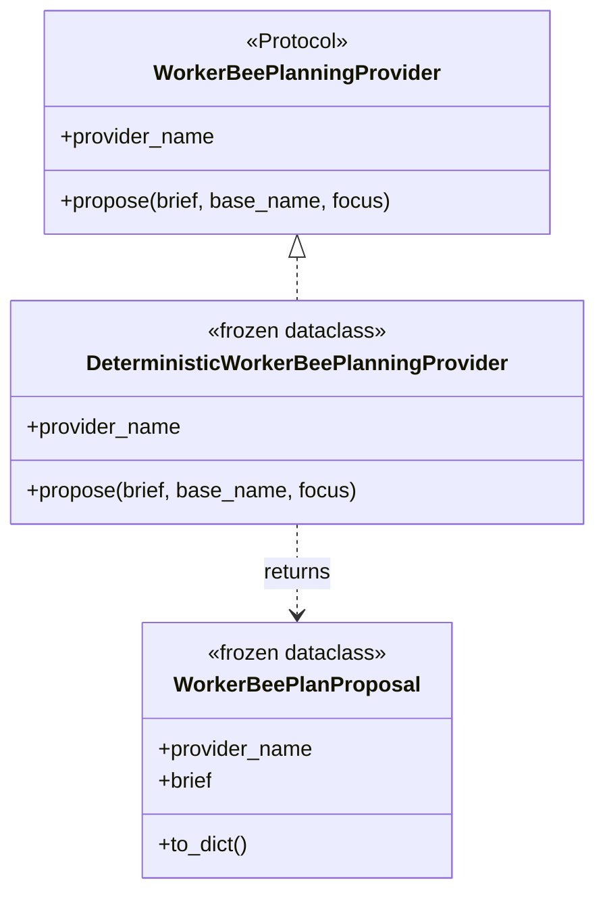

# Worker-Bee Object Model Observability Strategy

Review date: 2026-06-07

## Purpose

This strategy defines how to elevate worker-bee observability from execution-flow diagrams into first-class object-oriented architecture observation.

The current worker bee can scan Python source, build a code taxonomy, and render Mermaid `sequenceDiagram` blocks for functions and methods. That is useful for execution flow. The next capability should observe the object model itself: classes, dataclasses, protocols, inheritance, composition, method ownership, artifact bundles, report builders, renderer targets, and design-pattern coherence.

The target is a contract-backed object model artifact that can answer:

- What objects exist in the codebase?
- What role does each class play?
- Which objects depend on or compose other objects?
- Which classes are value objects, providers, visitors, report builders, renderers, or path bundles?
- Where is object-oriented design helping reuse and maintenance?
- Where is it creating overlap, drift, or duplicated shape?

## North Star

```text
source files
-> deterministic object-model scan
-> object-model taxonomy JSON
-> OO coherence audit
-> Mermaid classDiagram
-> Markdown architecture artifact
```

The JSON taxonomy remains the source of truth. Mermaid and Markdown are derived artifacts.

## Current Capability Boundary

Current worker-bee observation already does three important things:

- `worker-bee-taxonomy` extracts class, function, method, anchor, condition, call, mutation, and return metadata.
- `worker-bee-observe` converts execution paths into contract-backed Markdown.
- Mermaid `sequenceDiagram` output is generated coherently from structured data.

The gap is that class declarations are currently inventory anchors, while methods carry the diagrams. The worker bee does not yet render the object model as a `classDiagram`, nor does it audit object-oriented design patterns as first-class architecture facts.

## Target Capability

Add a new observation shape:

```text
object-model
```

This shape should generate:

- `*.object-model.schema.json`
- `*.object-model.json`
- `*.object-model.md`

The Markdown output should include:

- object model overview
- class inventory
- relationship inventory
- pattern inventory
- object-oriented coherence checks
- Mermaid `classDiagram` blocks
- links or anchors back to source code lines

## Implementation Surface

### New Module: `generation_fabric/worker_bee/object_model.py`

This module should own deterministic object-model extraction and contract building.

Core dataclasses:

```python
@dataclass(frozen=True)
class ObjectModelField:
    name: str
    annotation: str
    default_kind: str
    line_start: int
    line_end: int


@dataclass(frozen=True)
class ObjectModelMethod:
    name: str
    signature: str
    decorators: tuple[str, ...]
    calls: tuple[str, ...]
    mutations: tuple[str, ...]
    returns: tuple[str, ...]
    line_start: int
    line_end: int


@dataclass(frozen=True)
class ObjectModelClass:
    name: str
    qualified_name: str
    module_path: str
    source_file: str
    anchor: str
    bases: tuple[str, ...]
    decorators: tuple[str, ...]
    fields: tuple[ObjectModelField, ...]
    methods: tuple[ObjectModelMethod, ...]
    kind: str
    role: str
    responsibility: str
    pattern_signals: tuple[str, ...]


@dataclass(frozen=True)
class ObjectModelRelationship:
    source: str
    target: str
    relationship_type: str
    evidence: str
    anchor: str
    confidence: str


@dataclass(frozen=True)
class ObjectModelPatternSignal:
    class_name: str
    pattern: str
    status: str
    evidence: tuple[str, ...]


@dataclass(frozen=True)
class ObjectModelCoherenceCheck:
    check: str
    status: str
    detail: str
    symbols: tuple[str, ...]


@dataclass(frozen=True)
class ObjectModelDocument:
    source_roots: tuple[str, ...]
    source_hash: str
    shape: str
    summary: str
    classes: tuple[ObjectModelClass, ...]
    relationships: tuple[ObjectModelRelationship, ...]
    patterns: tuple[ObjectModelPatternSignal, ...]
    checks: tuple[ObjectModelCoherenceCheck, ...]
    metrics: dict[str, Any]
```

Public functions:

```python
def scan_python_object_model(paths: Sequence[Path], include_private: bool = False) -> ObjectModelDocument:
    ...


def build_object_model_document_schema(document: ObjectModelDocument, title: str = "") -> dict[str, Any]:
    ...


def build_object_model_report_document(document: ObjectModelDocument) -> tuple[dict[str, Any], dict[str, Any]]:
    ...
```

### New Module: `generation_fabric/worker_bee/object_diagram.py`

This module should own Mermaid rendering from the object-model JSON.

Public functions:

```python
def render_object_model_class_diagram(document: dict[str, Any], scope: str = "repo") -> str:
    ...


def render_object_model_package_diagrams(document: dict[str, Any]) -> tuple[dict[str, str], ...]:
    ...
```

The renderer should not rescan source code. It should consume the object-model document only.

### New Module: `generation_fabric/worker_bee/object_coherence.py`

This module should own design-pattern and OO coherence checks.

Public functions:

```python
def audit_object_model_coherence(document: ObjectModelDocument) -> tuple[ObjectModelCoherenceCheck, ...]:
    ...


def classify_object_pattern(model_class: ObjectModelClass) -> tuple[ObjectModelPatternSignal, ...]:
    ...
```

Keeping coherence checks separate from raw AST extraction keeps the scanner deterministic and allows the audit layer to evolve without rewriting the taxonomy.

## AST Extraction Rules

The scanner should capture facts that can be derived deterministically:

- class name
- module path
- source file
- line anchors
- base classes
- decorators
- docstring
- class-level annotations
- dataclass fields
- method signatures
- method decorators
- method calls
- mutation points
- return values
- imported symbols
- object instantiation calls
- method ownership

The scanner should classify classes into preliminary kinds:

- `value_object`
- `frozen_value_object`
- `protocol`
- `provider`
- `visitor`
- `exception`
- `artifact_paths`
- `artifact_bundle`
- `report_builder`
- `renderer_target`
- `command_session`
- `plain_class`

Classification should be evidence-based. For example:

- `@dataclass(frozen=True)` signals `frozen_value_object`.
- `Protocol` in bases signals `protocol`.
- `ast.NodeVisitor` in bases signals `visitor`.
- `Exception` in bases signals `exception`.
- fields ending in `_path` or containing several `Path` fields signal `artifact_paths`.
- methods such as `propose(...)` plus `provider_name` signal `provider`.
- methods such as `build_document(...)` and `build_report(...)` signal `report_builder`.

## Relationship Types

The object model should distinguish relationship kinds instead of flattening everything into calls.

Recommended relationship types:

- `inherits`: class extends another class.
- `implements_protocol`: class conforms to a protocol by declared base or structural method match.
- `composes`: class has a field typed as another class.
- `owns_method`: class owns a method.
- `instantiates`: method or function constructs a class.
- `accepts`: method or function accepts a class in an annotation.
- `returns`: method or function returns a class in an annotation or return expression.
- `serializes`: method serializes a dataclass or object to JSON-friendly data.
- `writes_artifact`: method or function writes schema, data, Markdown, or other files.
- `uses_renderer`: object or function calls a render target.

Every relationship should carry evidence:

```json
{
  "source": "DeterministicWorkerBeePlanningProvider",
  "target": "WorkerBeePlanningProvider",
  "relationship_type": "implements_protocol",
  "evidence": "propose(self, brief, base_name, focus)",
  "anchor": "generation_fabric/worker_bee/provider.py:44",
  "confidence": "high"
}
```

## Mermaid Class Diagram Conventions

The generated Mermaid should be simple, deterministic, and readable.

Recommended conventions:

- Use raw class names for Mermaid class identifiers when they are syntax-safe.
- Use annotations for major object kinds:
  - `<<dataclass>>`
  - `<<frozen>>`
  - `<<Protocol>>`
  - `<<Visitor>>`
  - `<<Exception>>`
  - `<<ArtifactPaths>>`
- Show inheritance with `<|--`.
- Show protocol implementation with `<|..`.
- Show composition with `*--` or `o--` only when there is clear field evidence.
- Show method ownership inside the class block.
- Omit low-value helper calls from class diagrams; those belong in sequence diagrams.

Example:



## Diagram Scoping

Large class diagrams become noisy quickly. The implementation should support scopes:

- `module`: one diagram per module.
- `package`: one diagram per package.
- `repo`: a summarized architecture diagram with only high-signal classes and relationships.

Default scope should be `package` for directories and `module` for a single source file.

For repository-wide observation, the Markdown report should render:

- one overview diagram
- one package diagram per package with classes
- a relationship table for cross-package dependencies

## Coherence Checks

The object-model audit should produce deterministic checks. These checks should not claim subjective design quality. They should identify observable architecture signals.

Recommended checks:

- `value_objects_are_frozen`: dataclass value objects should usually be frozen unless mutation is justified.
- `protocols_are_behavioral`: protocol classes should define behavior, not broad data bags.
- `provider_seams_are_narrow`: provider classes should not leak downstream execution details.
- `visitors_are_stateful_by_reason`: AST visitors may hold traversal state, but should not write files.
- `artifact_paths_are_consistent`: path bundle classes should share a consistent sidecar shape.
- `serialization_is_consistent`: dataclass `to_dict()` methods should use one JSON-friendly helper.
- `inheritance_depth_is_shallow`: deep inheritance should be flagged.
- `composition_has_named_fields`: composition should be visible through fields or annotations.
- `report_builders_share_lifecycle`: report builders should not duplicate schema/data/render/write lifecycle logic.
- `renderer_targets_are_parallel`: renderer modules should keep target-specific behavior symmetrical.
- `cli_does_not_own_domain_model`: command functions should orchestrate but not become domain objects.

Each check should emit:

- `check`
- `status`: `pass`, `warn`, or `fail`
- `detail`
- `symbols`
- `recommendation`

## Pattern Inventory

The report should include a pattern inventory table.

Initial pattern signals:

| Pattern | Evidence |
| --- | --- |
| Value Object | frozen dataclass, fields only, optional serializer |
| Provider Protocol | `Protocol` base, narrow method surface |
| Provider Adapter | implements provider method and returns proposal |
| Visitor | `ast.NodeVisitor` base and visit methods |
| Artifact Paths | multiple `Path` fields ending in `_path` |
| Artifact Bundle | dataclass carrying multiple rendered artifacts |
| Report Builder | build report, build document, render Markdown |
| Renderer Target | annotation namespace plus `render_*_document` |
| Command Session | mutable dataclass used only by CLI lifecycle |

The worker bee should use these signals to identify reuse opportunities. For example, several artifact path classes can be recognized as the same pattern before a human reviewer has to notice the duplication manually.

## CLI Strategy

Add a new command:

```powershell
python json_schema_crud.py worker-bee-object-model --source-file generation_fabric/worker_bee/provider.py --output generated/provider.object-model.md
```

Suggested arguments:

- `--source-file`: repeatable Python source file.
- `--source-dir`: directory to scan recursively.
- `--output`: Markdown output path.
- `--scope`: `module`, `package`, or `repo`.
- `--include-private`: include private classes and methods.
- `--overwrite`: allow replacing existing output.

The command should write:

- Markdown report at the requested output path.
- JSON data sidecar with the same stem.
- JSON Schema sidecar with the same stem.

Potential follow-up command:

```powershell
python json_schema_crud.py worker-bee-object-model-taxonomy --source-dir generation_fabric --output generated/fabric.object-model.json
```

This mirrors the current split between taxonomy extraction and observation reuse.

## Contract Shape

The object-model JSON should look conceptually like this:

```json
{
  "shape": "object-model",
  "source_roots": ["generation_fabric/worker_bee"],
  "source_hash": "sha256:...",
  "summary": "Observed 14 classes, 1 protocol, 11 frozen dataclasses, and 22 relationships.",
  "metrics": {
    "class_count": 14,
    "dataclass_count": 11,
    "frozen_dataclass_count": 10,
    "protocol_count": 1,
    "relationship_count": 22,
    "coherence_score": 86.7
  },
  "classes": [],
  "relationships": [],
  "patterns": [],
  "checks": [],
  "diagrams": [
    {
      "scope": "module",
      "name": "generation_fabric.worker_bee.provider",
      "language": "mermaid",
      "diagram": "classDiagram\n..."
    }
  ]
}
```

The Markdown renderer can then render diagrams as fenced code blocks with language `mermaid`.

## Markdown Report Shape

The generated Markdown should use this structure:

1. Overview
2. Metrics
3. Object Model Diagram
4. Package Or Module Diagrams
5. Class Inventory
6. Relationship Inventory
7. Pattern Signals
8. Coherence Checks
9. Recommendations

The report should be concise enough for review, but the JSON sidecar should retain the full taxonomy.

## Testing Plan

Add `tests/test_worker_bee_object_model.py`.

Minimum tests:

- scanner detects dataclasses, frozen dataclasses, protocols, visitors, and exceptions.
- scanner detects methods and parent-class ownership.
- scanner detects inheritance relationships.
- scanner detects protocol implementation relationships for the worker-bee provider module.
- scanner detects artifact path bundles.
- class diagram output includes `classDiagram`.
- class diagram output includes protocol, dataclass, and implementation notation.
- coherence audit flags repeated path bundle shapes.
- CLI writes schema, JSON, and Markdown sidecars.
- generated Markdown contains Object Model Diagram, Class Inventory, Relationship Inventory, and Coherence Checks.

Golden sample targets:

- `generation_fabric/worker_bee/provider.py`
- `generation_fabric/worker_bee/planner.py`
- `generation_fabric/layout/ascii_sketch.py`
- `generation_fabric/worker_bee/taxonomy.py`

These files cover provider protocols, frozen dataclasses, value objects, and AST visitors.

## Learning Loop Integration

Add a new capability to `DEFAULT_WORKER_BEE_LEARNING_CAPABILITIES`:

```text
worker-bee-object-model
```

Add a learning case that:

1. scans `generation_fabric/worker_bee/provider.py`
2. writes an object-model report
3. verifies the JSON has class and relationship records
4. verifies the Markdown has a Mermaid `classDiagram`
5. verifies at least one coherence check is present

This keeps the new capability benchmarked with the rest of the worker-bee surface.

## Implementation Phases

### Phase 1: Deterministic Object Scanner

Build `object_model.py` with class extraction, method extraction, field extraction, relationship extraction, and JSON-friendly dataclasses.

Do not add model enrichment yet.

### Phase 2: Class Diagram Renderer

Build `object_diagram.py` and render Mermaid `classDiagram` from the object-model JSON.

Keep diagrams scoped and deterministic.

### Phase 3: Coherence Audit

Build `object_coherence.py` with the first set of checks and pattern signals.

Start with checks that are mechanically visible from code.

### Phase 4: Contract-Backed Markdown Report

Generate schema and data for the report, then render Markdown through the existing Markdown renderer.

Use fenced Mermaid code blocks as data, not hand-stitched Markdown.

### Phase 5: CLI Command

Add `worker-bee-object-model` to `generation_fabric/cli.py`.

Reuse the existing sidecar write conventions until shared artifact writing helpers exist.

### Phase 6: Tests And Learning Loop

Add unit tests and learning-loop coverage.

The capability is not complete until it can be generated from the CLI and benchmarked by `worker-bee-learn`.

### Phase 7: Optional Provider Enrichment

After the deterministic taxonomy exists, a provider can enrich:

- role labels
- design-pattern explanations
- recommendations
- migration notes

Provider enrichment must not invent classes or relationships. It can only annotate deterministic facts already present in the taxonomy.

## Coherence Definition

A generated object model is coherent when:

- every diagram class exists in the JSON taxonomy
- every relationship has source-code evidence
- every class has a role and responsibility
- every Mermaid block is generated from structured data
- labels are readable but raw anchors are preserved
- large diagrams are scoped instead of overloaded
- coherence checks explain actionable design risks
- output can be regenerated deterministically from the same source files

## Risks

### Diagram Noise

Class diagrams become unreadable when every low-level relationship is drawn.

Mitigation: draw only structural relationships by default and put detailed calls in tables or sequence diagrams.

### False Pattern Classification

Some classes may look like providers, bundles, or report builders by naming convention only.

Mitigation: include confidence and evidence fields, and keep checks as `warn` unless evidence is strong.

### Duplicate Taxonomies

The existing code taxonomy and the new object-model taxonomy could drift.

Mitigation: share low-level helpers for anchors, source hashes, import aliases, decorators, line spans, and readable labels.

### Premature OO Framework

The implementation strategy should not force the codebase into class-heavy abstractions.

Mitigation: use object-model observation to improve design judgment, not to mandate inheritance.

## Success Criteria

The implementation is successful when:

- the worker bee can emit Mermaid `classDiagram` artifacts from Python source
- class diagrams are backed by schema and JSON
- object model relationships carry code anchors and evidence
- provider, dataclass, protocol, visitor, and artifact path patterns are detected
- coherence checks identify repeated or drifting OO shapes
- the learning loop includes object-model observability
- sequence diagrams and class diagrams complement each other instead of duplicating the same view

## Recommended First Milestone

Start with `generation_fabric/worker_bee/provider.py`.

It is the smallest high-value target because it contains:

- a frozen dataclass proposal
- a provider `Protocol`
- a deterministic provider implementation
- provider-backed packet construction
- clear method and return relationships

The first report should prove this shape:

```text
WorkerBeePlanningProvider
<|.. DeterministicWorkerBeePlanningProvider

DeterministicWorkerBeePlanningProvider
..> WorkerBeePlanProposal : returns

build_provider_backed_generation_packet
..> WorkerBeeGenerationPacket : builds
```

Once that works, expand to `worker_bee/`, then to the full `generation_fabric/` package.
