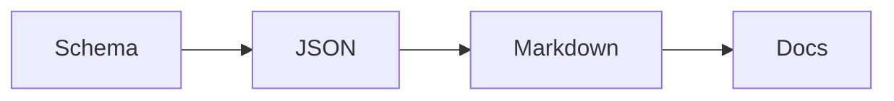
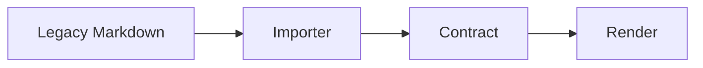

# Documentation Showcase

A schema-driven example that demonstrates Mermaid, C#, JSON, and nested sections.

This contract demonstrates how the generation fabric can render diagrams, code samples, and structured notes from a schema and JSON payload.

- Mermaid diagram
- C# fenced code
- JSON fenced code
- Nested sections

## Pipeline

The contract is still deterministic: schema validates JSON, then Markdown is rendered from the structured payload.



```csharp
public sealed class Example
{
    public string Title { get; init; } = "Generation Fabric";
}
```

```json
{
  "language": "json",
  "source": "schema + payload",
  "deterministic": true
}
```

- The diagram is emitted as a mermaid fence.
- The C# snippet stays syntax-highlighted.
- The JSON object is emitted as a fenced JSON block.

## Migration

Legacy Markdown can be imported, but the contract keeps the generator honest for new material.



```csharp
public static string Render() => "deterministic";
```

```json
{
  "migrated": true,
  "status": "ready"
}
```

- The importer can bootstrap a contract from existing docs.
- The registry keeps the new kind discoverable.
