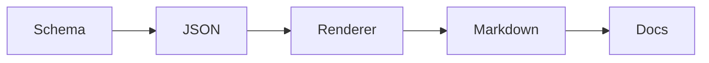
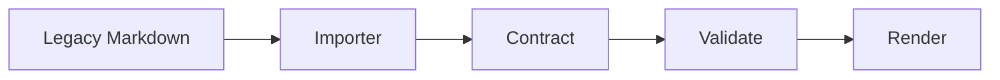

# Workflow Showcase

A contract-driven example that demonstrates workflow diagrams and ASCII sketches.

This example shows how the generation fabric can express workflow diagrams and ASCII sketches as first-class Markdown content.





```text
+----------------------+      +----------------------+
| Legacy Markdown      | ---> | Generation Fabric    |
+----------------------+      +----------------------+
          |                                |
          v                                v
   +--------------+                 +--------------+
   | Schema       |                 | Markdown     |
   +--------------+                 +--------------+
```

- Mermaid can describe the document pipeline.
- ASCII art can communicate the same story in a plain-text fallback.
- The Markdown renderer preserves both forms as fenced blocks.
