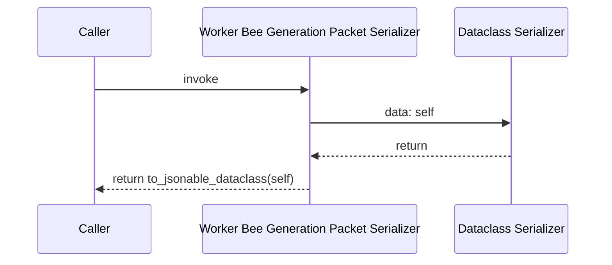
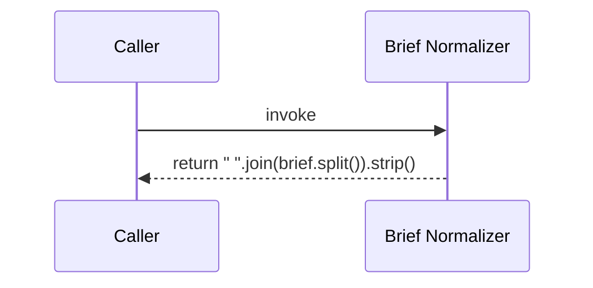
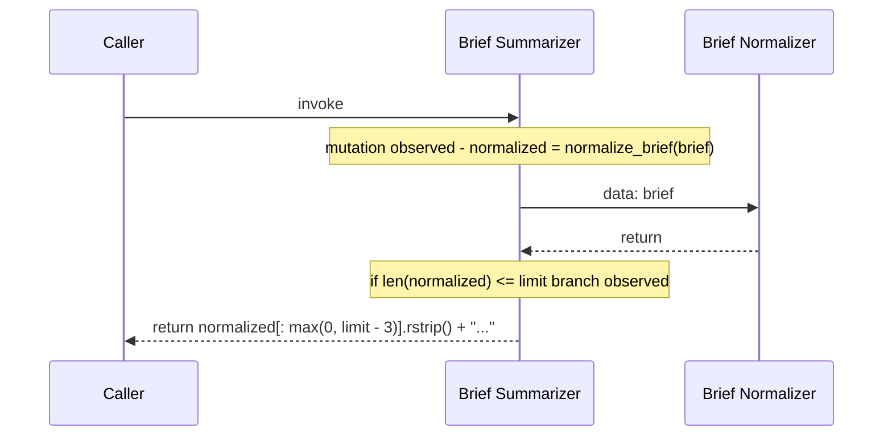
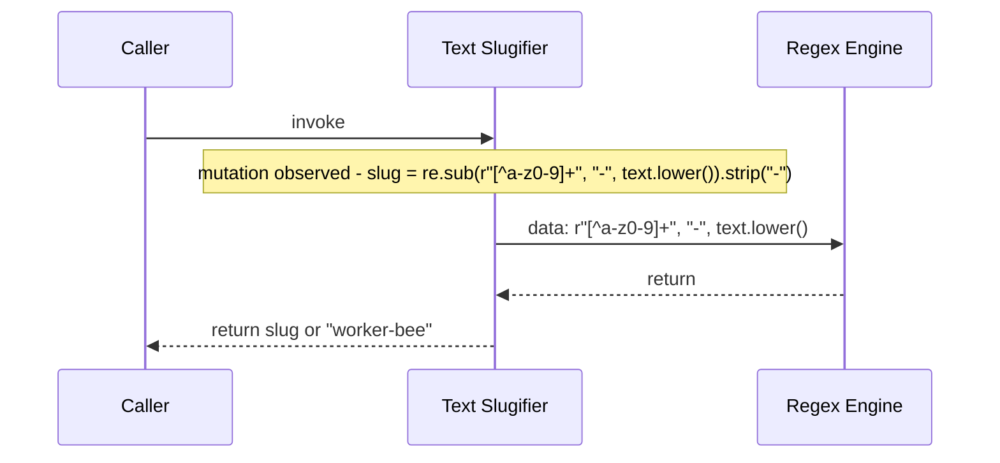
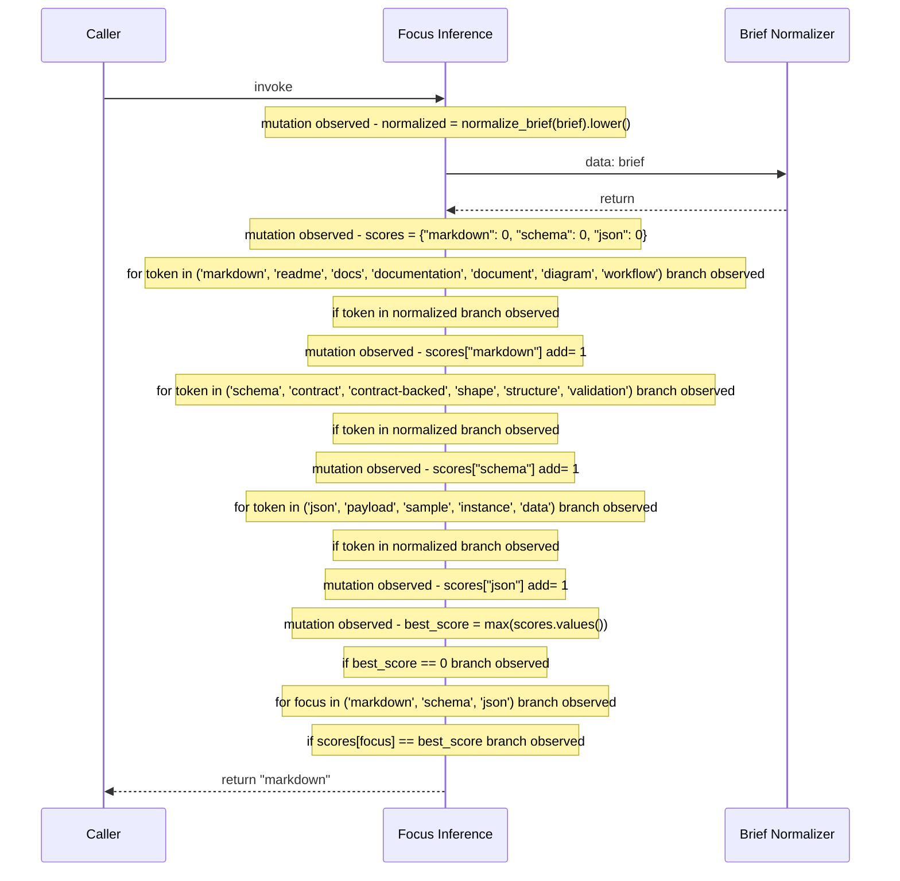
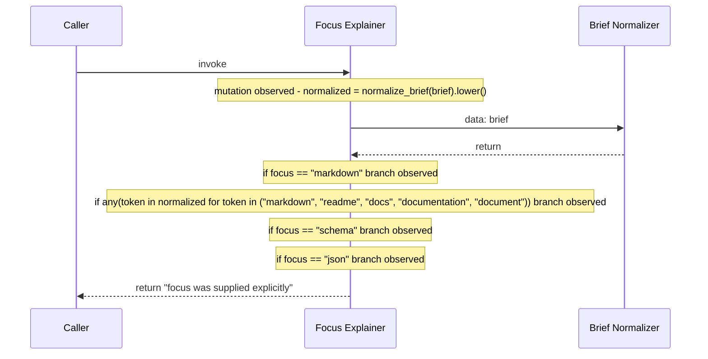
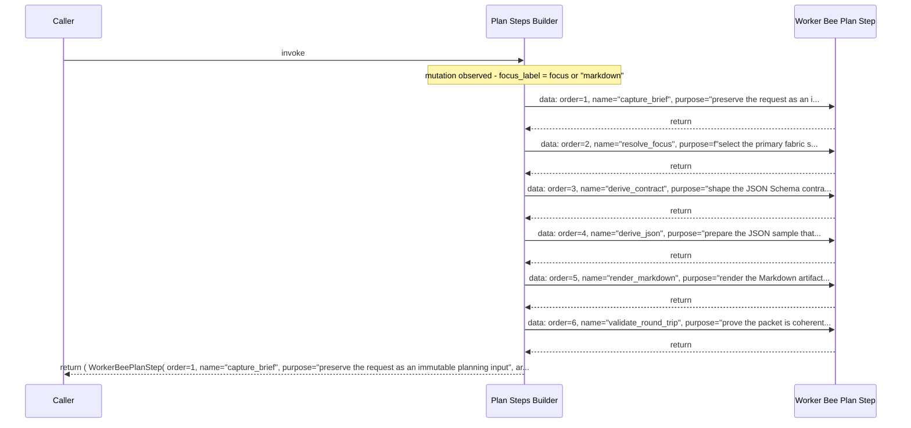
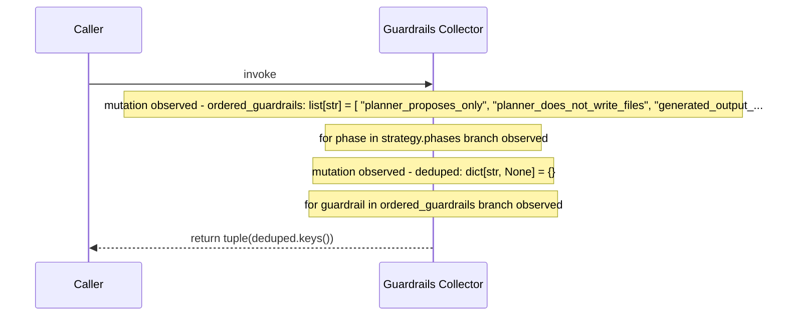
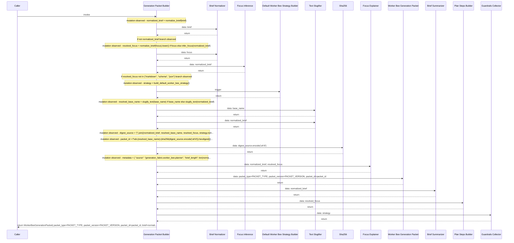

# Code Observation: planner

A contract-backed code observation that inventories the source file before rendering the observed executions, data batons, state changes, and returns as Mermaid sequence diagrams.

## Overview

**source_file**: generation_fabric/worker_bee/planner.py

**module_path**: generation_fabric.worker_bee.planner

**source_hash**: sha256:cf328803443d4ced5d9c2fba25dd9957f1a7cac820c6f1b33223745c90892a17

**shape**: sequence-diagram

Observed 9 execution(s) in planner.py and projected triggers, data batons, state changes, and returns into Mermaid sequence diagrams.

## Code Inventory

| label | kind | role | responsibility | anchor | line_start | line_end |
| --- | --- | --- | --- | --- | --- | --- |
| Worker Bee Plan Step | class | Worker Bee Plan Step | Describe one deterministic step in the worker-bee plan | generation_fabric/worker_bee/planner.py:32-38 | 32 | 38 |
| Worker Bee Generation Packet | class | Worker Bee Generation Packet | Describe a worker-bee packet that can drive the generation fabric | generation_fabric/worker_bee/planner.py:42-63 | 42 | 63 |
| Worker Bee Generation Packet To Dict | method | Worker Bee Generation Packet Serializer | Serialize the packet into a JSON-friendly structure | generation_fabric/worker_bee/planner.py:60-63 | 60 | 63 |
| Normalize Brief | function | Brief Normalizer | Normalize whitespace so the packet stays deterministic | generation_fabric/worker_bee/planner.py:66-69 | 66 | 69 |
| Summarize Brief | function | Brief Summarizer | Create a short summary of the brief for packet metadata | generation_fabric/worker_bee/planner.py:72-78 | 72 | 78 |
| Slugify Text | function | Text Slugifier | Convert arbitrary text into a stable lowercase slug | generation_fabric/worker_bee/planner.py:81-85 | 81 | 85 |
| Infer Focus | function | Focus Inference | Infer the dominant fabric surface from the brief | generation_fabric/worker_bee/planner.py:88-114 | 88 | 114 |
| Explain Focus | function | Focus Explainer | Explain why the packet resolved to a particular focus | generation_fabric/worker_bee/planner.py:117-129 | 117 | 129 |
| Build Plan Steps | function | Plan Steps Builder | Build the deterministic plan steps that every packet follows | generation_fabric/worker_bee/planner.py:132-173 | 132 | 173 |
| Collect Guardrails | function | Guardrails Collector | Flatten the strategy guardrails into a packet-level guardrail list | generation_fabric/worker_bee/planner.py:176-191 | 176 | 191 |
| Build Generation Packet | function | Generation Packet Builder | Build a deterministic worker-bee packet from a natural-language brief | generation_fabric/worker_bee/planner.py:194-234 | 194 | 234 |

## Executions

### Execution

**name**: WorkerBeeGenerationPacket.to_dict

**kind**: method

**role**: Worker Bee Generation Packet Serializer

**responsibility**: Serialize the packet into a JSON-friendly structure

**anchor**: generation_fabric/worker_bee/planner.py:60-63

```python
def WorkerBeeGenerationPacket.to_dict(self) -> dict[str, Any]
```

Serialize the packet into a JSON-friendly structure.

- Caller
- Worker Bee Generation Packet Serializer
- Dataclass Serializer

1. trigger Worker Bee Generation Packet Serializer
2. owner Worker Bee Generation Packet
3. return to_jsonable_dataclass(self)
4. data to_jsonable_dataclass: self

#### State Changes

#### Returns

to_jsonable_dataclass(self)



- Observed as a method in the code flow.
- Return points detected on lines: 63.
- Docstring captured as part of the contract.

### Execution

**name**: normalize_brief

**kind**: function

**role**: Brief Normalizer

**responsibility**: Normalize whitespace so the packet stays deterministic

**anchor**: generation_fabric/worker_bee/planner.py:66-69

```python
def normalize_brief(brief) -> str
```

Normalize whitespace so the packet stays deterministic.

- Caller
- Brief Normalizer

1. trigger Brief Normalizer
2. return " ".join(brief.split()).strip()
3. no helper calls observed

#### State Changes

#### Returns

" ".join(brief.split()).strip()



- Observed as a function in the code flow.
- Return points detected on lines: 69.
- Docstring captured as part of the contract.

### Execution

**name**: summarize_brief

**kind**: function

**role**: Brief Summarizer

**responsibility**: Create a short summary of the brief for packet metadata

**anchor**: generation_fabric/worker_bee/planner.py:72-78

```python
def summarize_brief(brief, limit=160) -> str
```

Create a short summary of the brief for packet metadata.

- Caller
- Brief Summarizer
- Brief Normalizer

1. trigger Brief Summarizer
2. mutation normalized = normalize_brief(brief)
3. data normalize_brief: brief
4. branch: if len(normalized) <= limit
5. return normalized
6. return normalized[: max(0, limit - 3)].rstrip() + "..."

#### State Changes

normalized = normalize_brief(brief)

#### Returns

normalized

normalized[: max(0, limit - 3)].rstrip() + "..."



- Observed as a function in the code flow.
- Branch markers detected: if.
- Captured 1 condition(s) for reuse by the worker bee.
- Captured 1 state change(s) for the execution path.
- Return points detected on lines: 77, 78.
- Docstring captured as part of the contract.

### Execution

**name**: slugify_text

**kind**: function

**role**: Text Slugifier

**responsibility**: Convert arbitrary text into a stable lowercase slug

**anchor**: generation_fabric/worker_bee/planner.py:81-85

```python
def slugify_text(text) -> str
```

Convert arbitrary text into a stable lowercase slug.

- Caller
- Text Slugifier
- Regex Engine

1. trigger Text Slugifier
2. mutation slug = re.sub(r"[^a-z0-9]+", "-", text.lower()).strip("-")
3. data re.sub: r"[^a-z0-9]+", "-", text.lower()
4. return slug or "worker-bee"

#### State Changes

slug = re.sub(r"[^a-z0-9]+", "-", text.lower()).strip("-")

#### Returns

slug or "worker-bee"



- Observed as a function in the code flow.
- Captured 1 state change(s) for the execution path.
- Return points detected on lines: 85.
- Docstring captured as part of the contract.

### Execution

**name**: infer_focus

**kind**: function

**role**: Focus Inference

**responsibility**: Infer the dominant fabric surface from the brief

**anchor**: generation_fabric/worker_bee/planner.py:88-114

```python
def infer_focus(brief) -> str
```

Infer the dominant fabric surface from the brief.

- Caller
- Focus Inference
- Brief Normalizer

1. trigger Focus Inference
2. mutation normalized = normalize_brief(brief).lower()
3. data normalize_brief: brief
4. mutation scores = {"markdown": 0, "schema": 0, "json": 0}
5. branch: for token in ('markdown', 'readme', 'docs', 'documentation', 'document', 'diagram', 'workflow')
6. branch: if token in normalized
7. mutation scores["markdown"] add= 1
8. branch: for token in ('schema', 'contract', 'contract-backed', 'shape', 'structure', 'validation')
9. branch: if token in normalized
10. mutation scores["schema"] add= 1
11. branch: for token in ('json', 'payload', 'sample', 'instance', 'data')
12. branch: if token in normalized
13. mutation scores["json"] add= 1
14. mutation best_score = max(scores.values())
15. branch: if best_score == 0
16. return "markdown"
17. branch: for focus in ('markdown', 'schema', 'json')
18. branch: if scores[focus] == best_score
19. return focus
20. return "markdown"

#### State Changes

normalized = normalize_brief(brief).lower()

scores = {"markdown": 0, "schema": 0, "json": 0}

scores["markdown"] add= 1

scores["schema"] add= 1

scores["json"] add= 1

best_score = max(scores.values())

#### Returns

"markdown"

focus



- Observed as a function in the code flow.
- Branch markers detected: for, if.
- Captured 9 condition(s) for reuse by the worker bee.
- Captured 6 state change(s) for the execution path.
- Return points detected on lines: 108, 112, 114.
- Docstring captured as part of the contract.

### Execution

**name**: explain_focus

**kind**: function

**role**: Focus Explainer

**responsibility**: Explain why the packet resolved to a particular focus

**anchor**: generation_fabric/worker_bee/planner.py:117-129

```python
def explain_focus(brief, focus) -> str
```

Explain why the packet resolved to a particular focus.

- Caller
- Focus Explainer
- Brief Normalizer

1. trigger Focus Explainer
2. mutation normalized = normalize_brief(brief).lower()
3. data normalize_brief: brief
4. branch: if focus == "markdown"
5. branch: if any(token in normalized for token in ("markdown", "readme", "docs", "documentation", "document"))
6. return "brief references markdown-oriented documentation"
7. return "no stronger surface signal was present, so markdown is the default"
8. branch: if focus == "schema"
9. return "brief references schema, contract, or validation language"
10. branch: if focus == "json"
11. return "brief references JSON, payload, or sample-data language"
12. return "focus was supplied explicitly"

#### State Changes

normalized = normalize_brief(brief).lower()

#### Returns

"brief references markdown-oriented documentation"

"no stronger surface signal was present, so markdown is the default"

"brief references schema, contract, or validation language"

"brief references JSON, payload, or sample-data language"

"focus was supplied explicitly"



- Observed as a function in the code flow.
- Branch markers detected: if.
- Captured 4 condition(s) for reuse by the worker bee.
- Captured 1 state change(s) for the execution path.
- Return points detected on lines: 123, 124, 126, 128, 129.
- Docstring captured as part of the contract.

### Execution

**name**: build_plan_steps

**kind**: function

**role**: Plan Steps Builder

**responsibility**: Build the deterministic plan steps that every packet follows

**anchor**: generation_fabric/worker_bee/planner.py:132-173

```python
def build_plan_steps(focus) -> tuple[WorkerBeePlanStep, ...]
```

Build the deterministic plan steps that every packet follows.

- Caller
- Plan Steps Builder
- Worker Bee Plan Step

1. trigger Plan Steps Builder
2. mutation focus_label = focus or "markdown"
3. return ( WorkerBeePlanStep( order=1, name="capture_brief", purpose="preserve the request as an immutable planning input", ar...
4. data WorkerBeePlanStep: order=1, name="capture_brief", purpose="preserve the request as an i...
5. data WorkerBeePlanStep: order=2, name="resolve_focus", purpose=f"select the primary fabric s...
6. data WorkerBeePlanStep: order=3, name="derive_contract", purpose="shape the JSON Schema contra...
7. data WorkerBeePlanStep: order=4, name="derive_json", purpose="prepare the JSON sample that...
8. data WorkerBeePlanStep: order=5, name="render_markdown", purpose="render the Markdown artifact...
9. data WorkerBeePlanStep: order=6, name="validate_round_trip", purpose="prove the packet is coherent...

#### State Changes

focus_label = focus or "markdown"

#### Returns

( WorkerBeePlanStep( order=1, name="capture_brief", purpose="preserve the request as an immutable planning input", ar...



- Observed as a function in the code flow.
- Captured 1 state change(s) for the execution path.
- Return points detected on lines: 136.
- Docstring captured as part of the contract.

### Execution

**name**: collect_guardrails

**kind**: function

**role**: Guardrails Collector

**responsibility**: Flatten the strategy guardrails into a packet-level guardrail list

**anchor**: generation_fabric/worker_bee/planner.py:176-191

```python
def collect_guardrails(strategy) -> tuple[str, ...]
```

Flatten the strategy guardrails into a packet-level guardrail list.

- Caller
- Guardrails Collector

1. trigger Guardrails Collector
2. mutation ordered_guardrails: list[str] = [ "planner_proposes_only", "planner_does_not_write_files", "generated_output_...
3. branch: for phase in strategy.phases
4. mutation deduped: dict[str, None] = {}
5. branch: for guardrail in ordered_guardrails
6. return tuple(deduped.keys())
7. no helper calls observed

#### State Changes

ordered_guardrails: list[str] = [ "planner_proposes_only", "planner_does_not_write_files", "generated_output_...

deduped: dict[str, None] = {}

#### Returns

tuple(deduped.keys())



- Observed as a function in the code flow.
- Branch markers detected: for.
- Captured 2 condition(s) for reuse by the worker bee.
- Captured 2 state change(s) for the execution path.
- Return points detected on lines: 191.
- Docstring captured as part of the contract.

### Execution

**name**: build_generation_packet

**kind**: function

**role**: Generation Packet Builder

**responsibility**: Build a deterministic worker-bee packet from a natural-language brief

**anchor**: generation_fabric/worker_bee/planner.py:194-234

```python
def build_generation_packet(brief, base_name='', focus='') -> WorkerBeeGenerationPacket
```

Build a deterministic worker-bee packet from a natural-language brief.

- Caller
- Generation Packet Builder
- Brief Normalizer
- Focus Inference
- Default Worker Bee Strategy Builder
- Text Slugifier
- Sha256
- Focus Explainer
- Worker Bee Generation Packet
- Brief Summarizer
- Plan Steps Builder
- Guardrails Collector

1. trigger Generation Packet Builder
2. mutation normalized_brief = normalize_brief(brief)
3. data normalize_brief: brief
4. branch: if not normalized_brief
5. mutation resolved_focus = normalize_brief(focus).lower() if focus else infer_focus(normalized_brief)
6. data normalize_brief: focus
7. data infer_focus: normalized_brief
8. branch: if resolved_focus not in {"markdown", "schema", "json"}
9. mutation strategy = build_default_worker_bee_strategy()
10. trigger build_default_worker_bee_strategy
11. mutation resolved_base_name = slugify_text(base_name) if base_name else slugify_text(normalized_brief)
12. data slugify_text: base_name
13. data slugify_text: normalized_brief
14. mutation digest_source = "|".join((normalized_brief, resolved_base_name, resolved_focus, strategy.nort...
15. mutation packet_id = f"wb-{resolved_base_name}-{sha256(digest_source.encode('utf-8')).hexdigest()[...
16. data sha256: digest_source.encode('utf-8')
17. mutation metadata = { "source": "generation_fabric.worker_bee.planner", "brief_length": len(norma...
18. data explain_focus: normalized_brief, resolved_focus
19. return WorkerBeeGenerationPacket( packet_type=PACKET_TYPE, packet_version=PACKET_VERSION, packet_id=packet_id, brief=normali...
20. data WorkerBeeGenerationPacket: packet_type=PACKET_TYPE, packet_version=PACKET_VERSION, packet_id=packet_id
21. data summarize_brief: normalized_brief
22. data build_plan_steps: resolved_focus
23. data collect_guardrails: strategy

#### State Changes

normalized_brief = normalize_brief(brief)

resolved_focus = normalize_brief(focus).lower() if focus else infer_focus(normalized_brief)

strategy = build_default_worker_bee_strategy()

resolved_base_name = slugify_text(base_name) if base_name else slugify_text(normalized_brief)

digest_source = "|".join((normalized_brief, resolved_base_name, resolved_focus, strategy.nort...

packet_id = f"wb-{resolved_base_name}-{sha256(digest_source.encode('utf-8')).hexdigest()[...

metadata = { "source": "generation_fabric.worker_bee.planner", "brief_length": len(norma...

#### Returns

WorkerBeeGenerationPacket( packet_type=PACKET_TYPE, packet_version=PACKET_VERSION, packet_id=packet_id, brief=normali...



- Observed as a function in the code flow.
- Branch markers detected: if.
- Captured 2 condition(s) for reuse by the worker bee.
- Captured 7 state change(s) for the execution path.
- Return points detected on lines: 219.
- Docstring captured as part of the contract.

- The worker bee extracts a shape from code before rendering any Markdown.
- The code inventory anchors declarations, while executions show triggers, data batons, mutations, and returns.
