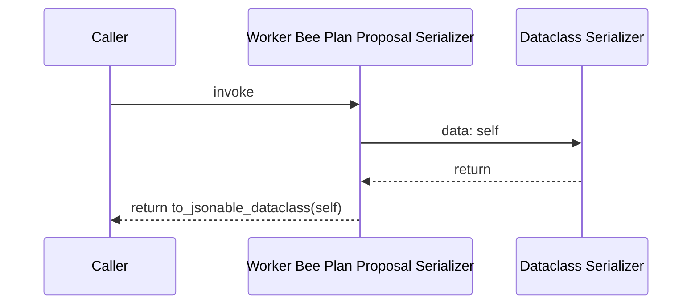
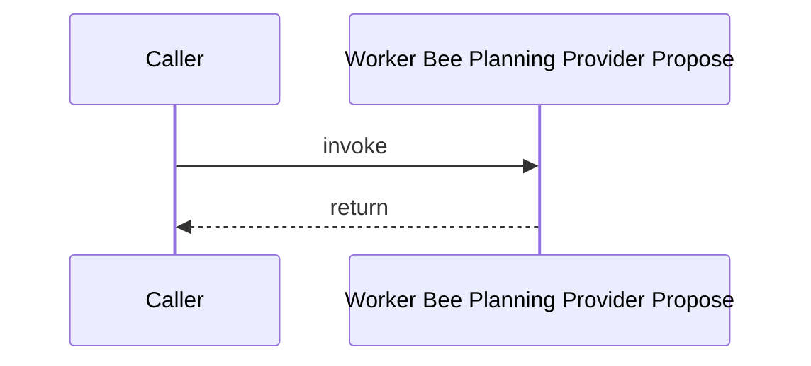
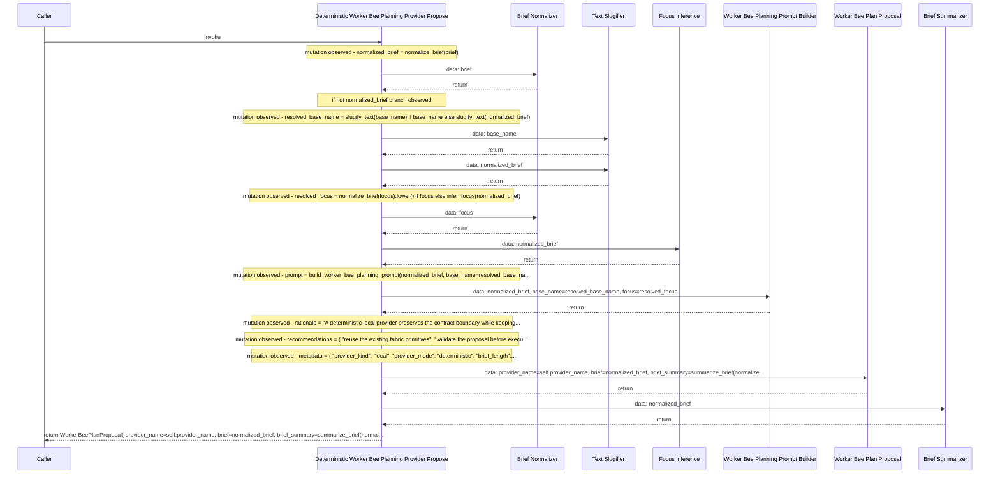
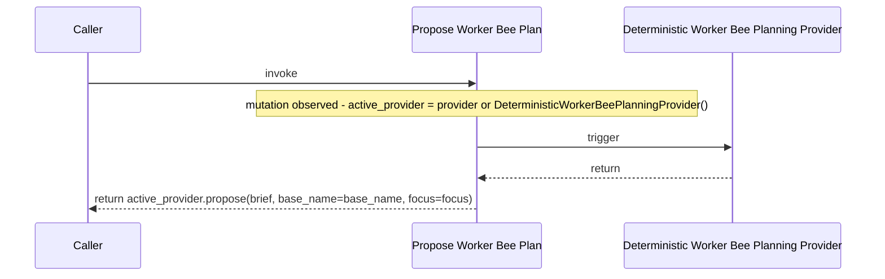
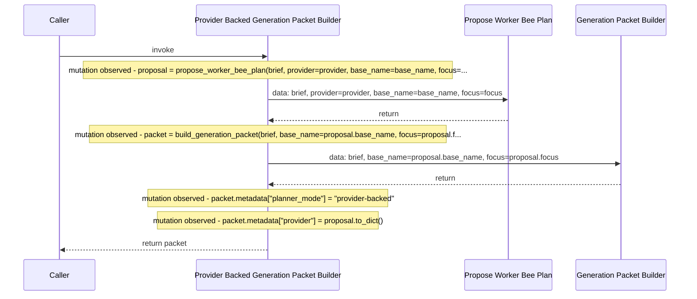

# Code Observation: provider

A contract-backed code observation that inventories the source file before rendering the observed executions, data batons, state changes, and returns as Mermaid sequence diagrams.

## Overview

**source_file**: generation_fabric/worker_bee/provider.py

**module_path**: generation_fabric.worker_bee.provider

**source_hash**: sha256:c0b26cae6040c133ee7039ce3c9319327e77a5b90822ff5e580c092b87814fac

**shape**: sequence-diagram

Observed 5 execution(s) in provider.py and projected triggers, data batons, state changes, and returns into Mermaid sequence diagrams.

## Code Inventory

| label | kind | role | responsibility | anchor | line_start | line_end |
| --- | --- | --- | --- | --- | --- | --- |
| Worker Bee Plan Proposal | class | Worker Bee Plan Proposal | Describe a provider-backed planning proposal | generation_fabric/worker_bee/provider.py:16-32 | 16 | 32 |
| Worker Bee Plan Proposal To Dict | method | Worker Bee Plan Proposal Serializer | Serialize the proposal into JSON-friendly data | generation_fabric/worker_bee/provider.py:29-32 | 29 | 32 |
| Worker Bee Planning Provider | class | Worker Bee Planning Provider | Protocol for a provider that proposes a worker-bee plan | generation_fabric/worker_bee/provider.py:35-41 | 35 | 41 |
| Worker Bee Planning Provider Propose | method | Worker Bee Planning Provider Propose | Return a planning proposal for a brief | generation_fabric/worker_bee/provider.py:40-41 | 40 | 41 |
| Deterministic Worker Bee Planning Provider | class | Deterministic Worker Bee Planning Provider | Deterministic provider used until a real model adapter is plugged in | generation_fabric/worker_bee/provider.py:45-84 | 45 | 84 |
| Deterministic Worker Bee Planning Provider Propose | method | Deterministic Worker Bee Planning Provider Propose | Return a deterministic planning proposal for a brief | generation_fabric/worker_bee/provider.py:50-84 | 50 | 84 |
| Propose Worker Bee Plan | function | Propose Worker Bee Plan | Produce a provider-backed planning proposal | generation_fabric/worker_bee/provider.py:87-97 | 87 | 97 |
| Build Provider Backed Generation Packet | function | Provider Backed Generation Packet Builder | Build a generation packet by first passing through a provider proposal | generation_fabric/worker_bee/provider.py:100-113 | 100 | 113 |

## Executions

### Execution

**name**: WorkerBeePlanProposal.to_dict

**kind**: method

**role**: Worker Bee Plan Proposal Serializer

**responsibility**: Serialize the proposal into JSON-friendly data

**anchor**: generation_fabric/worker_bee/provider.py:29-32

```python
def WorkerBeePlanProposal.to_dict(self) -> dict[str, Any]
```

Serialize the proposal into JSON-friendly data.

- Caller
- Worker Bee Plan Proposal Serializer
- Dataclass Serializer

1. trigger Worker Bee Plan Proposal Serializer
2. owner Worker Bee Plan Proposal
3. return to_jsonable_dataclass(self)
4. data to_jsonable_dataclass: self

#### State Changes

#### Returns

to_jsonable_dataclass(self)



- Observed as a method in the code flow.
- Return points detected on lines: 32.
- Docstring captured as part of the contract.

### Execution

**name**: WorkerBeePlanningProvider.propose

**kind**: method

**role**: Worker Bee Planning Provider Propose

**responsibility**: Return a planning proposal for a brief

**anchor**: generation_fabric/worker_bee/provider.py:40-41

```python
def WorkerBeePlanningProvider.propose(self, brief, base_name='', focus='') -> WorkerBeePlanProposal
```

Return a planning proposal for a brief.

- Caller
- Worker Bee Planning Provider Propose

1. trigger Worker Bee Planning Provider Propose
2. owner Worker Bee Planning Provider
3. no helper calls observed
4. return

#### State Changes

#### Returns

return



- Observed as a method in the code flow.
- Docstring captured as part of the contract.

### Execution

**name**: DeterministicWorkerBeePlanningProvider.propose

**kind**: method

**role**: Deterministic Worker Bee Planning Provider Propose

**responsibility**: Return a deterministic planning proposal for a brief

**anchor**: generation_fabric/worker_bee/provider.py:50-84

```python
def DeterministicWorkerBeePlanningProvider.propose(self, brief, base_name='', focus='') -> WorkerBeePlanProposal
```

Return a deterministic planning proposal for a brief.

- Caller
- Deterministic Worker Bee Planning Provider Propose
- Brief Normalizer
- Text Slugifier
- Focus Inference
- Worker Bee Planning Prompt Builder
- Worker Bee Plan Proposal
- Brief Summarizer

1. trigger Deterministic Worker Bee Planning Provider Propose
2. owner Deterministic Worker Bee Planning Provider
3. mutation normalized_brief = normalize_brief(brief)
4. data normalize_brief: brief
5. branch: if not normalized_brief
6. mutation resolved_base_name = slugify_text(base_name) if base_name else slugify_text(normalized_brief)
7. data slugify_text: base_name
8. data slugify_text: normalized_brief
9. mutation resolved_focus = normalize_brief(focus).lower() if focus else infer_focus(normalized_brief)
10. data normalize_brief: focus
11. data infer_focus: normalized_brief
12. mutation prompt = build_worker_bee_planning_prompt(normalized_brief, base_name=resolved_base_na...
13. data build_worker_bee_planning_prompt: normalized_brief, base_name=resolved_base_name, focus=resolved_focus
14. mutation rationale = "A deterministic local provider preserves the contract boundary while keeping...
15. mutation recommendations = ( "reuse the existing fabric primitives", "validate the proposal before execu...
16. mutation metadata = { "provider_kind": "local", "provider_mode": "deterministic", "brief_length":...
17. return WorkerBeePlanProposal( provider_name=self.provider_name, brief=normalized_brief, brief_summary=summarize_brief(normal...
18. data WorkerBeePlanProposal: provider_name=self.provider_name, brief=normalized_brief, brief_summary=summarize_brief(normalize...
19. data summarize_brief: normalized_brief

#### State Changes

normalized_brief = normalize_brief(brief)

resolved_base_name = slugify_text(base_name) if base_name else slugify_text(normalized_brief)

resolved_focus = normalize_brief(focus).lower() if focus else infer_focus(normalized_brief)

prompt = build_worker_bee_planning_prompt(normalized_brief, base_name=resolved_base_na...

rationale = "A deterministic local provider preserves the contract boundary while keeping...

recommendations = ( "reuse the existing fabric primitives", "validate the proposal before execu...

metadata = { "provider_kind": "local", "provider_mode": "deterministic", "brief_length":...

#### Returns

WorkerBeePlanProposal( provider_name=self.provider_name, brief=normalized_brief, brief_summary=summarize_brief(normal...



- Observed as a method in the code flow.
- Branch markers detected: if.
- Captured 1 condition(s) for reuse by the worker bee.
- Captured 7 state change(s) for the execution path.
- Return points detected on lines: 74.
- Docstring captured as part of the contract.

### Execution

**name**: propose_worker_bee_plan

**kind**: function

**role**: Propose Worker Bee Plan

**responsibility**: Produce a provider-backed planning proposal

**anchor**: generation_fabric/worker_bee/provider.py:87-97

```python
def propose_worker_bee_plan(brief, provider=None, *, base_name='', focus='') -> WorkerBeePlanProposal
```

Produce a provider-backed planning proposal.

- Caller
- Propose Worker Bee Plan
- Deterministic Worker Bee Planning Provider

1. trigger Propose Worker Bee Plan
2. mutation active_provider = provider or DeterministicWorkerBeePlanningProvider()
3. trigger DeterministicWorkerBeePlanningProvider
4. return active_provider.propose(brief, base_name=base_name, focus=focus)

#### State Changes

active_provider = provider or DeterministicWorkerBeePlanningProvider()

#### Returns

active_provider.propose(brief, base_name=base_name, focus=focus)



- Observed as a function in the code flow.
- Captured 1 state change(s) for the execution path.
- Return points detected on lines: 97.
- Docstring captured as part of the contract.

### Execution

**name**: build_provider_backed_generation_packet

**kind**: function

**role**: Provider Backed Generation Packet Builder

**responsibility**: Build a generation packet by first passing through a provider proposal

**anchor**: generation_fabric/worker_bee/provider.py:100-113

```python
def build_provider_backed_generation_packet(brief, provider=None, *, base_name='', focus='')
```

Build a generation packet by first passing through a provider proposal.

- Caller
- Provider Backed Generation Packet Builder
- Propose Worker Bee Plan
- Generation Packet Builder

1. trigger Provider Backed Generation Packet Builder
2. mutation proposal = propose_worker_bee_plan(brief, provider=provider, base_name=base_name, focus=...
3. data propose_worker_bee_plan: brief, provider=provider, base_name=base_name, focus=focus
4. mutation packet = build_generation_packet(brief, base_name=proposal.base_name, focus=proposal.f...
5. data build_generation_packet: brief, base_name=proposal.base_name, focus=proposal.focus
6. mutation packet.metadata["planner_mode"] = "provider-backed"
7. mutation packet.metadata["provider"] = proposal.to_dict()
8. return packet

#### State Changes

proposal = propose_worker_bee_plan(brief, provider=provider, base_name=base_name, focus=...

packet = build_generation_packet(brief, base_name=proposal.base_name, focus=proposal.f...

packet.metadata["planner_mode"] = "provider-backed"

packet.metadata["provider"] = proposal.to_dict()

#### Returns

packet



- Observed as a function in the code flow.
- Captured 4 state change(s) for the execution path.
- Return points detected on lines: 113.
- Docstring captured as part of the contract.

- The worker bee extracts a shape from code before rendering any Markdown.
- The code inventory anchors declarations, while executions show triggers, data batons, mutations, and returns.
